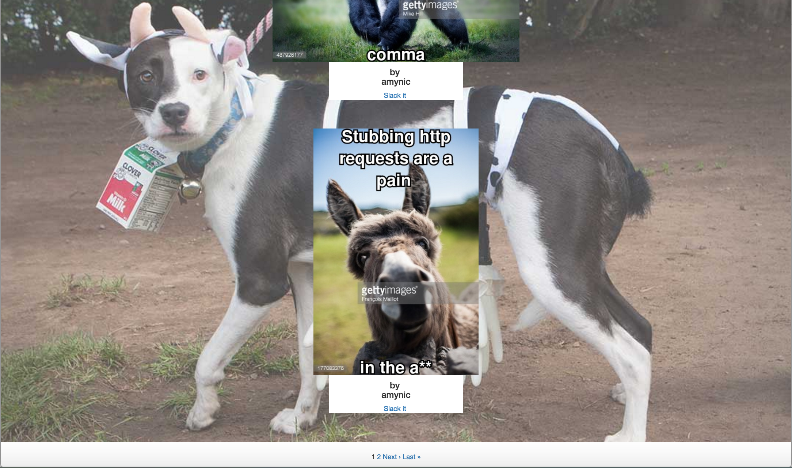

# Memeories

## Introduction

Ever wanted to share your precise emotional state with your colleagues on Slack, but found emoji just don’t cut it?

Then *Memeories* may be for you!

Memeories allows you to *quickly combine images and text to create a meme that can then be shared to a Slack channel* with the click of a button.

## Dev team

Amy Nicholson
Chris Coates
Ollie Haydon-Mulligan
Grig Gerogiokas
Adam Skuse

## How to use

Visit http://memeories.herokuapp.com

You will see the “Mood Board” of user-generated memes.

You will need to sign up and log in in order to create a meme. Do so by clicking the relevant links.

### Creating a meme

Once you are logged in, click “Make Meme.”

Then enter search terms for an image. We suggest using the following formula:
_(mood) + (animal)_

Select your desired image by clicking on it.

You will then be prompted to enter text to display at the top and bottom of your meme. Do so, then click “Add text”.

If successful, you will be taken back to the mood board, where you will be able to see your newly-minted meme.

### Sharing a meme

Click the "Slack It” link beneath the image you wish to share. Enter the codeword for your slack channel (provided by one of your channel’s admin). Then click “Share on Slack.”

### Deleting a meme

If you wish to delete a meme that you have created, click “Delete” beneath the meme on the mood board.

You can not delete memes that were created by other users.

## Screenshot

## Tech used

*Basic build*
Memeories is built with Ruby on Rails
It uses Javascript and the Jquery library, HTML 5 and CSS.

*APIs*
[Getty](http://developers.gettyimages.com/) for image search.
[Cloudinary](http://cloudinary.com/documentation/api_and_access_identifiers) for overlaying text on images.
[Slack webhooks](https://api.slack.com/incoming-webhooks) for posting to a channel.
[Paperclip]

## How to test locally

### Clone the project and set up databases
git clone git@github.com:missamynicholson/Memeories.git
bundle install
bin/rake db:create db:migrate
bin/rake db:migrate RAILS_ENV=test

### Required ENV variables

*For Getty Images API:*
GETTY_ACCESS_KEY

*For Cloudinary:*
CLOUD_NAME
CLOUD_KEY
CLOUD_SECRET

*For Amazon S3 Bucket:*
S3_BUCKET_NAME_MEME
AWS_ACCESS_KEY_ID
AWS_SECRET_ACCESS_KEY (needs to be in region ‘eu-west-1’)

*Slack Webhook:*
SLACK_HOOK

*Memeories post-to-slack codeword:*
CODE_WORD

## Issues yet to be resolved

Getty is not an ideal choice for search due to its embedded watermarks.

Username link (in the top left) goes nowhere.

Memes can be created without text.

Hard-coded “codeword” for posting is an issue in terms of security and extensibility.

## Future features for implementation

Add image sources other than Getty.

Slack integration - users log in with their Slack accounts. This would allow users to post to different channels, and remove the need for the “codeword”.

Allow users to ‘like’ memes on the mood board.

Order the memes on the mood board by number of likes.

Order the memes on the mood board by number of times posted.

Allow users to see detailed info on each meme e.g. raw image URL, number of times posted, where and when it has been posted.

Allow users to comment on memes.

Personal mood boards - users can see a history of their meme creations, a history of memes they’ve posted, and share these histories to Slack/Facebook.

END OF DOC
